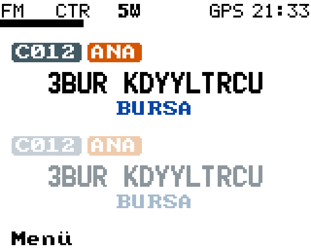
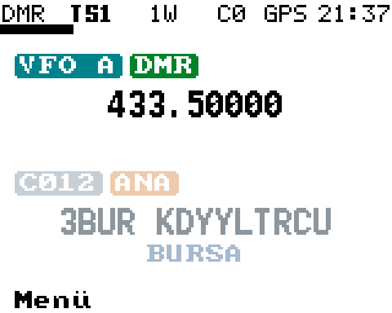
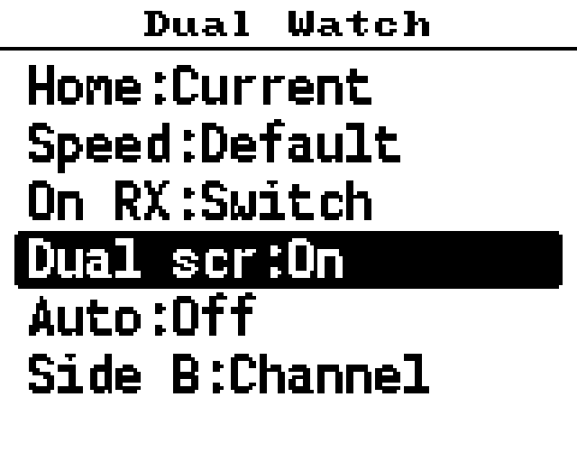
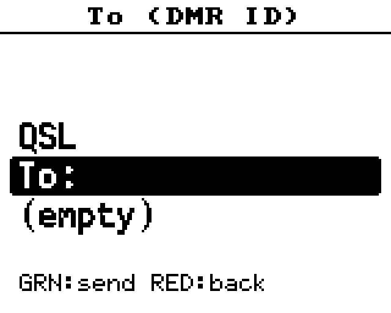
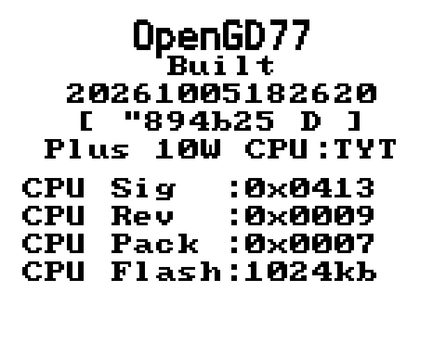

# md-uv390-firmware

An **unofficial, personal fork of [OpenGD77](https://www.opengd77.com/)** for the
**TYT MD-UV390 Plus (10W)**, the colour-screen, GPS, IP67 dual-band DMR handheld of the
MDUV380 radio family (the same source also builds for the **MD-UV380 / MD-UV390 (5W), Retevis RT3S, Retevis RT-84 and Baofeng DM-1701**,
see [Other radios](#other-radios)).

Maintained by Eren Bozaci, **TA3BZC**. Not affiliated with the OpenGD77 project: if you want the canonical firmware,
use [opengd77.com](https://www.opengd77.com/).

## Why this fork exists

OpenGD77 is a great firmware, but I wanted my own radio to behave a bit more like a modern dual-display handheld
(the Anytone way of working), and to be able to send and read text messages. So this fork adds, on top of the OpenGD77
R20260131 source release:

| Feature | What it does | Status |
|---|---|---|
| **Dual screen (Anytone style)** | Two independent rows, A on top and B below. Each row is either a VFO or a channel with its **own zone**. Up/Down select the row, the red key switches the active row between VFO and channel, the rotary changes the frequency / channel. Coloured badges (`C004`, `DMR`/`ANA`), `RX` badge while receiving, `Menü` label. | Working, tested on the radio |
| **Dual Watch options** | Options → Dual Watch: auto start, speed, home VFO, "stay" (beep instead of switching to a signal on the other side), second side can be a zone channel. | Implemented, only partly tested |
| **Messages** | Inbox, compose, canned messages, new-message beep. | Implemented, lightly tested |
| **APRS messages** | Send `:CALLSIGN :text{id` through the existing AFSK encoder (analog channels). No APRS receive. | Implemented, needs an APRS config on the channel |
| **DMR SMS** | Receive and send private text messages (DMR data call driven by the HR-C6000, following the chip manual). | **Experimental, never tested on air** |
| **Tools** | `uv390.sh` (build / flash / screenshot), `screen_grab.py` (read the radio's screen over USB). | Working |
| Fixes | Codec interface rewritten with C function pointers (builds with a current GCC), firmware version shown correctly when built in a container. | Done |

**Not possible on this hardware:** receiving two frequencies *at the same time*. The MDUV380 has a single AT1846S RF
chip and a single DMR modem, so "dual watch" is fast switching between the two sides, not true dual receive.

## Screenshots

Taken from the real radio with `./uv390.sh doc <name>`.

| Home (dual screen) | VFO row | Dual Watch options |
|---|---|---|
|  |  |  |

| Messages menu | Firmware info |
|---|---|
|  |  |

## Key reference for the dual screen

Turn it on in **Options → Dual Watch → "Dual scr: On"**.

| Key | Action |
|---|---|
| Up / Down arrow | Select the other row (A / B) |
| Red | Active row: VFO ↔ channel |
| Rotary | Change the frequency (VFO row) or the channel (channel row) |
| Green | Menu |
| SK1 / SK2 combinations, long presses | Stock OpenGD77 behaviour |

## Getting started

### 1. What you need

- Linux (macOS works too), `git`, `python3`
- **docker or podman** (the ARM toolchain runs in a container, nothing else to install)
- A USB cable and the radio
- The **codec donor file** (see below). Without it the radio ends up **FM only**.

### 2. Get the source

```sh
git clone https://github.com/erenbozaci/md-uv390-firmware.git
cd md-uv390-firmware
```

### 3. The AMBE codec donor (required for DMR)

This repository contains **no AMBE codec code or data**. The codec is patched into the binary at flash time from an
official TYT firmware file, which you must obtain yourself. The loader accepts exactly one file:

- `MD9600-CSV(2571V5)-V26.45.bin`, SHA-256 `d8a653307222e576ee416ab6d4704d14758fa71c1b0e826ffd840f26266cf11f`

Put it in `donor/` (that folder is git-ignored, never commit it). The first `./uv390.sh flash` registers it for you.
Other MD9600 firmware files (for example the `P26.45` GPS one) are rejected by the loader, and that does **not** affect
the radio's GPS: the donor is only used for the codec.

### 4. Build

```sh
./uv390.sh build           # clean build in a container, result: MDUV380_firmware/build/OpenGD77_MDUV380_UV380_PLUS_10W.bin
./uv390.sh size            # flash / RAM usage
```

Other radios: `PLATFORM=RT84_DM1701 VARIANT=DM1701 ./uv390.sh build`, or by hand from `MDUV380_firmware/`:

```sh
make build PLATFORM=MDUV380 VARIANT=UV380_PLUS_10W     # UV390 Plus 10W
make build PLATFORM=MDUV380                            # MD-UV380 / RT3S
make build PLATFORM=RT84_DM1701 VARIANT=DM1701         # RT-84 / DM-1701
make build-all                                         # all three, results in dist/
```

> The RAM of the MDUV380 build is almost full (a few hundred bytes free). If you add features, run
> `./uv390.sh size` after each addition; a link error "region `RAM' overflowed" means you went too far.

### 5. Flash

Put the radio in **DFU mode**: power it off, hold **SK1**, power it on (the screen stays blank), connect USB.

```sh
./uv390.sh flash           # checks that the DMR codec was patched in ("Patching for DMR")
./uv390.sh all             # build + wait for DFU + flash + screenshot
```

The helper creates a Python virtual environment (`.venv`, with `pyusb`, `pyserial`, `pillow`) the first time.
The loader is `MDUV380_firmware/tools/opengd77_stm32_firmware_loader.py` if you prefer to drive it yourself
(`-m MD-UV380 -f <bin>`).

### 6. Screenshots of the running radio

```sh
./uv390.sh shot                    # screen.png
./uv390.sh doc home                # docs/screenshots/home.png (used by this README)
```

The radio shows up as a USB serial port; the tool reads the display buffer with the CPS read command, so no special
firmware mode is needed. It does not work while the radio is in DFU or hotspot mode.

## Other radios

The tree builds three firmware images. The UV390 Plus 10W is the radio this fork is developed and tested on.
**The other two build and link cleanly (CI builds all three), but have not been run on a real radio by the author.**

| Radio | Release file | `PLATFORM` / `VARIANT` | Loader model (`-m`) |
|---|---|---|---|
| **TYT MD-UV390 Plus 10W** (also an MD-UV380 / RT3S with the 10W power-amp mod) | `OpenGD77_MD-UV390_Plus_10W.bin` | `MDUV380` / `UV380_PLUS_10W` | `MD-UV380` |
| TYT MD-UV380 / MD-UV390 (5W), Retevis RT3S (with GPS) | `OpenGD77_MD-UV380_RT3S.bin` | `MDUV380` / *(none)* | `MD-UV380` |
| Retevis RT-84, Baofeng DM-1701 | `OpenGD77_RT84_DM1701.bin` | `RT84_DM1701` / `DM1701` | `DM-1701` |

Build and flash the other images with the same helper, selecting the radio with environment variables:

```sh
# TYT MD-UV380 / MD-UV390 (5W), Retevis RT3S
PLATFORM=MDUV380 VARIANT= MODEL=MD-UV380 ./uv390.sh build
PLATFORM=MDUV380 VARIANT= MODEL=MD-UV380 ./uv390.sh flash

# Retevis RT-84, Baofeng DM-1701
PLATFORM=RT84_DM1701 VARIANT=DM1701 MODEL=DM-1701 ./uv390.sh build
PLATFORM=RT84_DM1701 VARIANT=DM1701 MODEL=DM-1701 ./uv390.sh flash

# all three at once, results in MDUV380_firmware/dist/
cd MDUV380_firmware && make build-all CONTAINER_ENGINE=docker
```

Notes for these radios:

- **Same codec donor** (`MD9600-CSV(2571V5)-V26.45.bin`, see above): every STM32 radio of the family gets its AMBE codec from it.
- **DFU mode:** on the MD-UV380 / MD-UV390 / RT3S family power the radio off, hold **SK1**, power on. For the RT-84 and
  DM-1701 the author has not verified the key combination, check the radio's own bootloader instructions (usually a side
  key held while powering on).
- **The dual screen layout is drawn for the MD-UV380/390 display** (160x128). On the DM-1701 the usable screen is shorter, so
  the rows and the `Menü` label may not fit. The RT-84 / DM-1701 key mapping (`KEY_FRONT_UP/DOWN`) is also untested here.
- **Not supported by this tree:** MD-2017 / RT82, MD-9600 / RT90, MD-380 / RT3 (their source trees are separate upstream
  archives, see `PLANS/unify_sourcecodes.md`) and the NXP MK22 radios (GD-77, GD-77S, RD-5R, DM-1801...), which are a
  different project.

## Repository layout

| Path | Contents |
|---|---|
| `MDUV380_firmware/` | The firmware source (OpenGD77 R20260131 plus the changes above) |
| `MDUV380_firmware/application/source/functions/messaging.c` | Inbox, APRS / DMR message glue |
| `MDUV380_firmware/application/source/user_interface/uiDualScreen.c` | The dual screen |
| `MDUV380_firmware/application/source/hardware/HR-C6000.c` | DMR chip driver (DMR data transmit and receive hooks) |
| `MDUV380_firmware/tools/` | Firmware loader, `codec_cleaner.py`, `screen_grab.py` |
| `hr-c6000/` | HR-C6000 chip documentation used for the DMR SMS work |
| `uv390.sh` | Build / flash / screenshot helper |
| `CLAUDE.md` | Notes for AI coding assistants working in this repo (architecture, gotchas) |
| `PLANS/` | Design notes |

## How this repository was set up

- It started from the OpenGD77 MDUV380/DM1701/RT3S/RT-84 source release (R20260131), through an earlier working copy of
  that source maintained by EA4IPW (`opengd77-rt3s-experiments`, see `UPSTREAM_README.md` and the git history).
  The `Makefile` there was reconstructed from the STM32CubeIDE `.cproject` so that the firmware builds on the command line
  in a container (`Containerfile`).
- The fork then grew the features listed above. The HR-C6000 manual and register notes in `hr-c6000/` were the basis for
  the DMR data (SMS) code.

## Known limitations

- DMR SMS has never been tested on the air. The text goes out as raw UTF-16 with SAP 0, which only this firmware
  reads; commercial radios expect IP/UDP text. Received messages are decoded heuristically (UDT and short data are ignored).
- The message inbox lives in RAM (12 messages) and is lost at power-off.
- Only one receiver: the non-active row is not monitored (Dual Watch switches quickly between the sides).
- With the dual screen on, the arrow keys no longer change the squelch / the talkgroup (use the options and the quick menu).

## Downloads and releases

Ready-made images are published as GitHub Releases. The three files and a `SHA256SUMS` file are attached to each release:

| File | Radio |
|---|---|
| `OpenGD77_MD-UV390_Plus_10W.bin` | TYT MD-UV390 Plus 10W (the author's radio) |
| `OpenGD77_MD-UV380_RT3S.bin` | TYT MD-UV380 / MD-UV390 (5W), Retevis RT3S |
| `OpenGD77_RT84_DM1701.bin` | Retevis RT-84, Baofeng DM-1701 |

They contain **no AMBE codec**: flash them with the loader of this repository (`./uv390.sh flash`, see
[Getting started](#getting-started)), which patches the codec in from the donor file. Another flashing tool gives an FM only radio.

To publish a release, push a tag named `R<upstream date>-TA3BZC.<n>` (for example `R20260131-TA3BZC.1`). GitHub Actions
(`.github/workflows/build.yml`) then builds the three variants, renames the files as above, writes `SHA256SUMS` and creates the
release. (Tags `R*-EA4IPW*` of the earlier working copy still work.)

```sh
git tag -a R20260131-TA3BZC.1 -m "Dual screen, Dual Watch options, messaging"
git push origin R20260131-TA3BZC.1
```

## License: non-commercial only

The OpenGD77 source code is distributed under a **modified BSD-3-Clause license with an explicit non-commercial
restriction** (see [`license.txt`](license.txt) and [`MDUV380_firmware/tools/license.txt`](MDUV380_firmware/tools/license.txt)).
Relevant clause:

> 4. Use of this source code or binary releases for commercial purposes is strictly forbidden. This includes, without limitation,
> incorporation in a commercial product or incorporation into a product or project which allows commercial use.

This restriction inherits to any fork or derivative work, including this one. Bundled third-party components keep their
own licenses: CMSIS (Apache-2.0), STM32F4xx HAL (BSD-3-Clause), ST USB Device Library (ST SLA0044), FreeRTOS (MIT),
SEGGER RTT (SEGGER custom BSD-like). Do not redistribute the TYT firmware used as codec donor.

## Credits

OpenGD77 is the work of Kai DG4KLU, Roger VK3KYY, Daniel F1RMB, Alex DL4LEX, Colin G4EML, Jason VK7ZJA (SK) and many
other contributors (see [`UPSTREAM_README.md`](UPSTREAM_README.md)). The VFO sweep band scope / waterfall experiments, the
command line build and the release automation come from the earlier EA4IPW working copy this repository was started from. Dual screen, Dual Watch options, messaging and DMR SMS work: Eren Bozaci, TA3BZC.
Upstream release zips: <https://www.opengd77.com/downloads/releases/>, user guide:
<https://github.com/LibreDMR/OpenGD77_UserGuide>.

## Türkçe özet

TYT **MD-UV390 Plus (10W)** telsizim için OpenGD77 tabanlı, kişisel bir firmware çatalı.

**Amaç:** Telsizi Anytone gibi iki satırlı (A üstte, B altta) bir ana ekranla kullanmak. Her satır bağımsız olarak bir VFO
ya da **kendi bölgesinden** bir kanal olabiliyor. Satırların başında küçük renkli rozetler var (`C004`, `DMR` / `ANA`),
sinyal alırken `RX` rozeti çıkıyor, altta `Menü` yazıyor. Ayrıca kısa mesaj (APRS ve DMR SMS) göndermek ve okumak,
Dual Watch'ı ayarlardan yönetmek için yapıldı.

**Kurulum:**
1. Docker veya Podman, `git`, `python3` kurulu olsun.
2. `git clone https://github.com/erenbozaci/md-uv390-firmware.git`
3. DMR codec'i için resmi TYT dosyası `MD9600-CSV(2571V5)-V26.45.bin`'i `donor/` klasörüne koy
   (SHA-256: `d8a65330...f11f`, dosya repoda yok ve commit edilmez). Bu olmadan telsiz **sadece FM** çalışır.
4. `./uv390.sh build`
5. Telsizi DFU moduna al (kapalıyken **SK1** basılı tut, aç) ve `./uv390.sh flash`
6. Ekran görüntüsü için `./uv390.sh shot` (README görüntüleri için `./uv390.sh doc <isim>`).

**Diğer telsizler:** Aynı kaynak MD-UV380 / MD-UV390 (5W), Retevis RT3S, Retevis RT-84 ve Baofeng DM-1701 için de derleniyor
(yukarıdaki "Other radios" tablosu). Örneğin `PLATFORM=RT84_DM1701 VARIANT=DM1701 MODEL=DM-1701 ./uv390.sh build`. Bu iki
görüntü derleniyor ama gerçek telsizde denenmedi, iki satırlı ekran yalnızca MD-UV380/390 ekranına göre çizildi.
Hazır dosyalar GitHub Releases'te: `OpenGD77_MD-UV390_Plus_10W.bin`, `OpenGD77_MD-UV380_RT3S.bin`, `OpenGD77_RT84_DM1701.bin`.

**Dürüst durum:** İki satırlı ekran telsizde denendi ve çalışıyor. DMR SMS henüz havada **denenmedi** (deneysel).
Telsizde tek alıcı olduğu için aynı anda iki frekansı dinlemek donanım olarak mümkün değil, Dual Watch hızlı geçiş yapar.
Mesaj kutusu RAM'de (12 mesaj), kapanınca silinir. Lisans ticari kullanımı yasaklar.

73, TA3BZC
